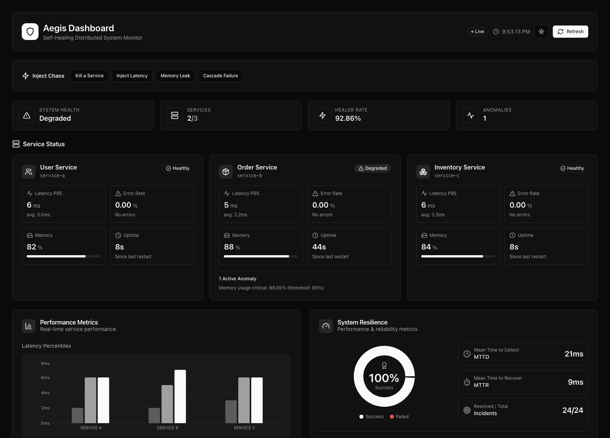
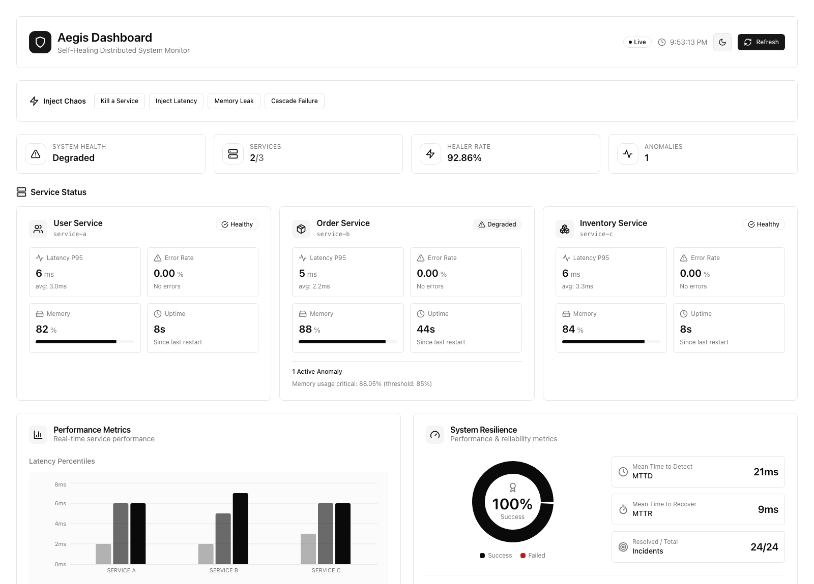
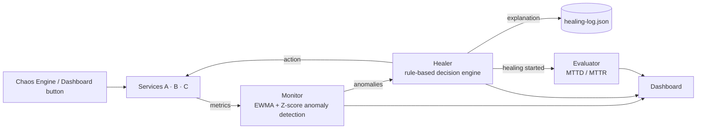

# Aegis

**A self-healing distributed system that detects failures, explains its reasoning, and recovers automatically — no Kubernetes, no cloud services, no paid APIs.**

Aegis runs three microservices, watches them with statistical anomaly detection (EWMA + Z-score), and heals them with a rule-based decision engine that logs *why* it acted, not just *what* it did. Chaos engineering is built in, so you can break the system on purpose and watch it recover in real time.

[](LICENSE)


**Live demo:** _add your `https://aegis.<vm-ip>.sslip.io` URL here once deployed — see [Hosting a public demo](#hosting-a-public-demo)._

<p align="center">
  
</p>
<p align="center"><em>Live data, not a mockup — one service degraded from a real memory-exhaustion anomaly, MTTD/MTTR computed from an actual incident just above.</em></p>

<details>
<summary>Light mode</summary>
<p align="center">
  
</p>
</details>

---

## Highlights

- Designed and built a self-healing distributed system that autonomously detects, diagnoses, and recovers from service failures using statistical anomaly detection and a rule-based decision engine.
- Implemented an explainability layer where every automated action logs its symptoms, root cause, confidence score, and outcome — instead of a black-box restart.
- Built a chaos-engineering harness (CLI + in-dashboard controls) to trigger real container kills, latency injection, and memory leaks, validating recovery under fault conditions.
- Measured system resilience quantitatively: Mean Time To Detect and Mean Time To Recover, computed from real incident lifecycles, not static placeholders.
- Hardened and shipped a public-facing demo mode: rate-limited chaos triggers, an allowlisted action set, and admin-token-gated manual overrides, safe to expose on the open internet.
- Rebuilt the dashboard on shadcn/ui with a fully accessible, monochrome design system (light/dark) where color is reserved exclusively for genuine critical/failure states.

## Table of Contents

- [Architecture](#architecture)
- [How It Works](#how-it-works)
- [Quick Start](#quick-start)
- [Chaos Engineering](#chaos-engineering)
- [API Reference](#api-reference)
- [Evaluation Metrics](#evaluation-metrics)
- [Tech Stack](#tech-stack)
- [Project Structure](#project-structure)
- [Hosting a Public Demo](#hosting-a-public-demo)
- [Roadmap](#roadmap)
- [License](#license)

## Architecture



Five independent services, each with a single responsibility:

| Service | Role |
|---|---|
| **Service A / B / C** | Fault-injectable Express microservices (user/order/inventory) |
| **Monitor** | Polls services, maintains rolling EWMA + variance baselines, flags anomalies |
| **Healer** | Matches anomalies to rules, scores confidence, executes the action, logs the reasoning |
| **Evaluator** | Tracks incident lifecycles (detected → healing → resolved) to compute MTTD/MTTR |
| **Dashboard** | React + shadcn/ui, real-time via polling, monochrome with one reserved color for genuine failures |

## How It Works

**1. Monitoring** — the Monitor polls every service every 5s for latency (P50/P95/P99), error rate, memory, and uptime.

**2. Anomaly Detection** — each metric is compared against a per-service EWMA baseline using Z-score thresholding (`Welford's algorithm` for online variance), classified into severity (`low` / `medium` / `high` / `critical`).

**3. Decision** — the Healer's rule engine matches anomaly patterns (type + severity + count) to a healing action and a confidence score, with cooldowns to prevent restart storms.

**4. Action** — executed against the real Docker API via `dockerode`: container restart, or a routing/scaling/throttle response for lower-severity cases.

**5. Explainability** — every action is written to `logs/healing-log.json` as a structured record:

```json
{
  "time": "12:41:02",
  "service": "service-a",
  "symptoms": ["latency spike", "error burst"],
  "root_cause": "memory exhaustion",
  "action": "restart",
  "confidence": 0.87
}
```

**6. Evaluation** — the Healer notifies the Evaluator the instant it starts acting on an incident, so Mean Time To Detect and Mean Time To Recover are measured from real timestamps, not estimated after the fact.

## Quick Start

**Prerequisites:** Docker & Docker Compose, Node.js 20+

```bash
# Backend: services A/B/C, monitor, healer, evaluator
docker-compose up --build

# Dashboard, in a separate terminal
cd dashboard && npm install && npm run dev
```

Open the printed Vite URL (typically `http://localhost:5173`). Click **Inject Chaos** to kill a container, add latency, leak memory, or run a full cascade — then watch the dashboard detect it, explain the root cause, and heal it.

| Service | Port |
|---|---|
| Service A (User) | 3001 |
| Service B (Order) | 3002 |
| Service C (Inventory) | 3003 |
| Monitor | 4000 |
| Healer | 4001 |
| Evaluator | 4002 |
| Dashboard (dev) | 5173 |

## Chaos Engineering

From the dashboard (rate-limited to 1 scenario / 45s, safe for a shared public demo):

- **Kill a Service** — `docker kill` on a random container
- **Inject Latency** — real added response delay
- **Memory Leak** — real, unbounded heap growth until the threshold trips
- **Cascade Failure** — latency → error burst → container kill, chained across all three services

Or from the CLI:

```bash
chmod +x chaos/inject-failures.sh
./chaos/inject-failures.sh                          # interactive menu
./chaos/inject-failures.sh kill aegis-service-a
./chaos/inject-failures.sh latency aegis-service-b 2000
./chaos/inject-failures.sh scenario cascade
```

## API Reference

**Monitor** (`:4000`)
- `GET /status` — overall system + per-service health and metrics
- `GET /anomalies` — currently detected anomalies
- `GET /metrics/:serviceName` — metrics history
- `GET /baselines/:serviceName` — EWMA baselines

**Healer** (`:4001`)
- `GET /status` — decision stats and success rate
- `GET /decisions/:serviceName` — decision history
- `GET /healing-log` — recent explainability log entries
- `POST /heal/:serviceName` — manual override (requires `X-Admin-Token` when `PUBLIC_DEMO=true`)
- `POST /chaos/trigger` — allowlisted, rate-limited chaos (`{ "scenario": "kill-random" | "latency-random" | "memory-leak-random" | "cascade" }`)
- `GET /containers` — container states

**Evaluator** (`:4002`)
- `GET /metrics` — current MTTD / MTTR / success rate
- `GET /timeline` — metrics bucketed over time
- `GET /services` — per-service resilience metrics

## Evaluation Metrics

The Evaluator tracks every incident's full lifecycle — `detected → healing started → resolved` — using real timestamps pushed by the Healer at the moment it acts, so:

- **MTTD** — Mean Time To Detect (anomaly detected → healer starts acting)
- **MTTR** — Mean Time To Recover (healer starts acting → service confirmed healthy)
- **Success Rate** — resolved vs. failed recoveries
- **False Positives** — incidents that self-resolved before the healer ever acted

None of these are placeholders — trigger a chaos scenario and watch the numbers move.

## Tech Stack

| Layer | Technology |
|---|---|
| Language | TypeScript (strict), Node.js |
| Services | Express |
| Containers | Docker, Docker Compose |
| Anomaly detection | Custom EWMA + Z-score, no external monitoring stack |
| Dashboard | React, Vite, shadcn/ui, Radix, Tailwind CSS, Recharts |
| Chaos testing | Bash + a rate-limited HTTP API |
| Reverse proxy (public demo) | Caddy (automatic HTTPS) |
| Logging | Structured JSON, file-based |

## Project Structure

```
aegis/
├── services/            # Service A/B/C — fault-injectable microservices
├── src/
│   ├── shared/           # Types, config, logger
│   ├── monitor/          # Metrics collector + anomaly detector
│   ├── healer/           # Decision engine, actions, chaos API
│   └── evaluator/        # Incident tracking, MTTD/MTTR
├── dashboard/            # React + shadcn/ui dashboard
├── chaos/                # Chaos engineering CLI
├── router/               # Routing configuration
├── deploy/               # Public-demo deployment runbook
├── logs/                 # Explainability log (healing-log.json)
├── Caddyfile / docker-compose.prod.yml   # Public demo hosting
└── docker-compose.yml
```

## Hosting a Public Demo

Aegis runs locally by default. [`deploy/runbook.md`](deploy/runbook.md) walks through putting a hardened, live version on the internet for free — an Oracle Cloud Always Free VM + `sslip.io` (no domain purchase needed) + Caddy for automatic HTTPS. The public build:

- Gates the manual `/heal` override behind an admin token
- Only exposes the rate-limited, allowlisted chaos-trigger endpoint to visitors
- Runs the real Docker-backed healing actions — not a simulation

## Roadmap

Honest state of a portfolio project, not a finished product:

- [ ] `scale_up` / `scale_down` / `remove_from_routing` currently log intent but don't yet reconfigure real infrastructure — only `restart` executes a real Docker action
- [ ] `router/routing-config.json` is defined but not yet read by any service
- [ ] No automated test suite yet for the decision engine or anomaly detector, despite both being pure, deterministic logic well-suited to unit tests
- [ ] Metrics/incidents are in-memory — restarting the Monitor/Healer/Evaluator clears learned baselines and history (the explainability log on disk is the one thing that survives)

## License

MIT
